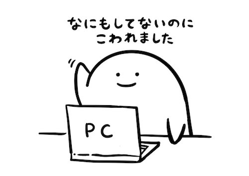
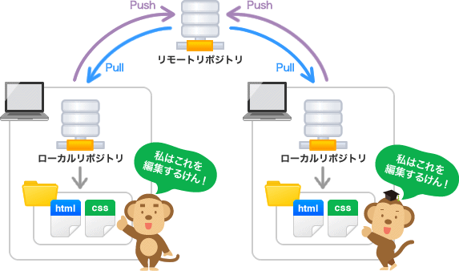

# gitまとめ
## 目次
- [gitって何？](#about_git)
- [gitの基本](#git_basis)
- [Gitで使うコマンド，pull,add,commit,pushして共同作業](git_Documents/git_commands.md)
- [branchを切って安全に作業を](git_Documents/git_branch.md) 
- ytakashinaさんによるSourceTree講座

<a name="about_git"></a>
## gitって何?
分散型バージョン管理システム．
複数人で開発をするときにはバージョン管理が必須．
- 変更してはいけないところを変更してしまった!
- 変更した結果動かなくなってしまった!
- 最新版がどれかわからなくなった!
- 最新版を消してしまった!
- 他の人が作ってくれたファイルを上書きしてしまった!
- など

複数人で作業するときには気をつけないと取り返しのつかない失敗をしてしまうことがある．作業するたびにファイルを保存してしまうと無駄なファイルがたくさんできちゃう．うざい．

もっと簡潔にファイルの管理をしたいなぁ....

`git 様` の出番

インストールすると使えるようになります．
Bashなら
```
$ apt-get install git 
```
で入る？
### gitでできること
> Gitでは、ファイルの状態を好きなときに更新履歴として保存しておくことができます。そのため、一度編集したファイルを過去の状態に戻したり、編集箇所の差分を表示したりすることができます。
> また、古いファイルを元に編集したファイルで、他人の編集した最新ファイルを上書きしようとすると、サーバにアップロードした時に警告が出ます。そのため、知らず知らずのうちに他人の編集内容を上書きしてしまうといった失敗は起こりません。　


<a name="git_basis"></a>
## gitの基本
Gitではファイルやディレクトリの状態を保存する場所を**リポジトリ**と呼ぶ．
そのリポジトリの管理下に置くことで変更履歴を保存することができる．

### リポジトリ
リポジトリには**リモートリポジトリ**と**ローカルリポジトリ**がある．

- リモートリポジトリ
	複数人で共有してファイルなどを共有
- ローカルリポジトリ
	作業する各人のPC上のディレクトリでリモートリポジトリと紐づいている
    
リモートとローカルに分けることで普段の作業は自分のPC上で行い，機能開発が終わった段階でリモートにアップロードして共有する，という流れで開発ができる．

