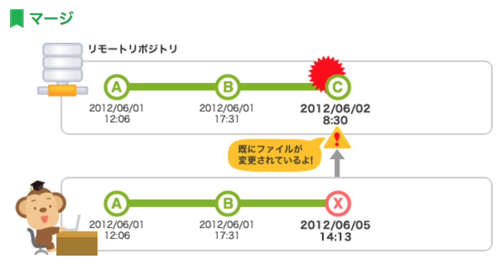
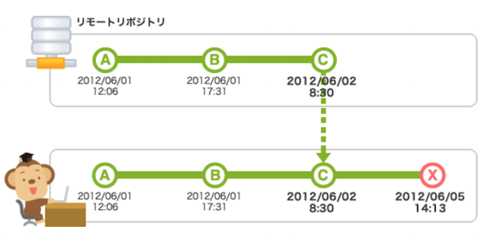

# 変更履歴のマージ
Merge：統合する(動詞)

これまで，ローカルで作業を進めてリモートにpushするという流れを確認した．
しかし，単純にpushできない場合がある．<br>

<br>
この場合，他の人がすでにpushしてリモートの内容が書き換わっているために素直にpushするとその人の変更内容が失われてしまう．<br>
よって，**リモート上での変更をローカルに取り込む**まではpushできないようになっている．<br>

<br>
そこで使うのがfetchとmerge．
> pullを実行すると、リモートリポジトリの内容のマージが自動的に行われてしまいます。しかし、単にリモートリポジトリの内容を確認したいだけの時はマージをしたくない場合もあります。そのような時はfetchを使用します。

> fetchを実行すると、リモートリポジトリの最新の履歴の取得だけを行うことができます。取得したコミットは、名前の無いブランチとして取り込まれます。このブランチはFETCH_HEADという名前でチェックアウトすることができます。
```
$ git fetch #履歴の取得
$ git merge FEATCH_HEAD #現在のブランチに最新の履歴を統合
```
または，
```
$ git pull <ブランチ名> #fetchとmergeを同時に行う
```

同じ箇所(プログラム的に区別できない箇所)に変更があると**競合**という問題が起こる．


## 競合(Conflict)
マージを行うと，Gitが自動的に変更分を統合してくれる．しかし競合があると自動ではできない．<br>
よって，手動でその箇所を修正しないとダメ．<br>
競合が発生したときの警告．`test.py`で競合が発生している．

```
(master)$ git merge issue2
Updating 7582a5d..aa1e561
Fast-forward
 test.py | 1 +
 1 file changed, 1 insertion(+)
 
(master)$ git merge issue3
Auto-merging test.py
CONFLICT (content): Merge conflict in test.py
Automatic merge failed; fix conflicts and then commit the result. 
```

`test.py`はどうなっているかというと，
```
<<<<<<< HEAD
print('From issue2')
=======
print('From issue3')
>>>>>>> issue3
```

`====`の上がHEADといって最新の変更履歴を表している．<br>
下が今回`merge`しようとして出来なかった部分<br>
競合している部分をこのように直し，

```
print('コンフリクトの解決')
```
```
$ git add .
$ git commit -m 'コンフリクトの解決'
$ python test.py
コンフリクトの解決
```
となって解決．