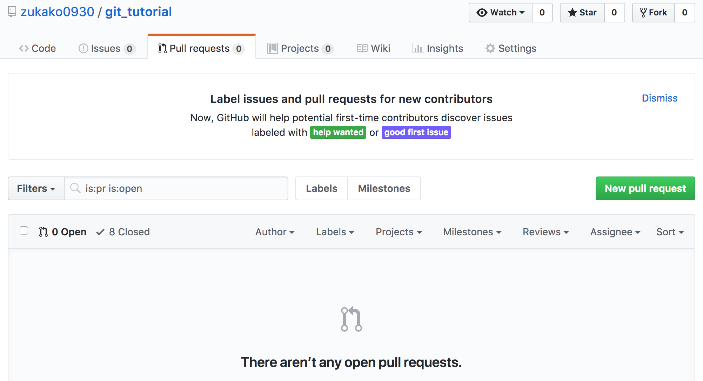
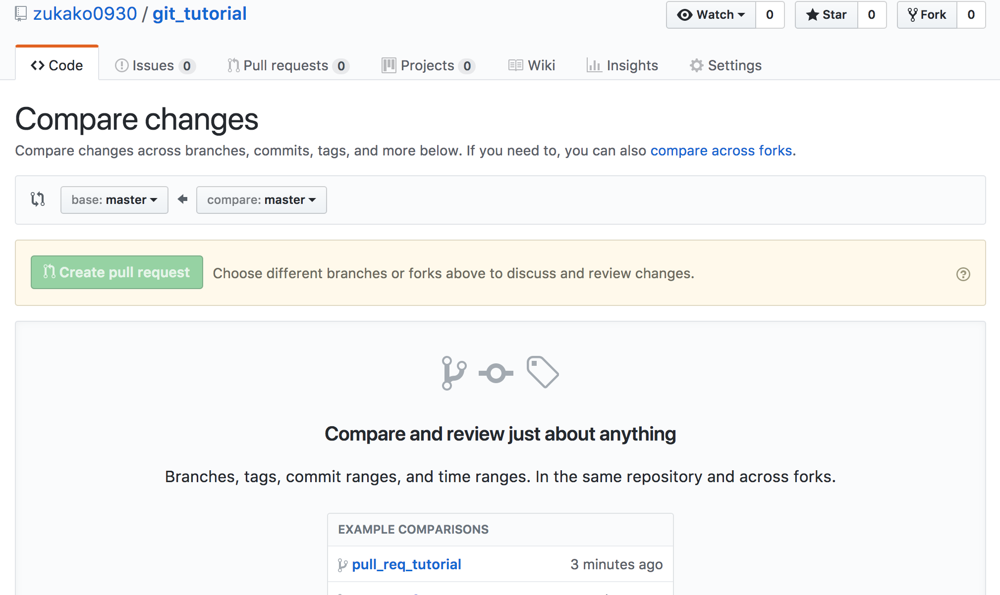
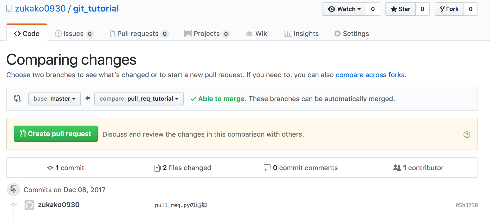
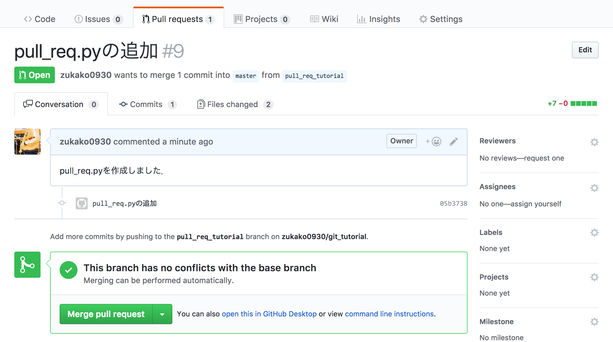
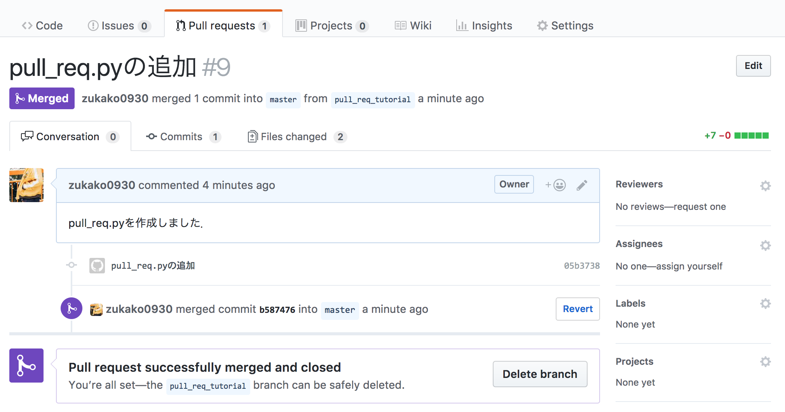

# Pull Requestの作成
## プルリクエストってなんでしょうか？
ローカルの作業が終わってリモートの作業ブランチにpushしました．そうしたらgithub上でプルリクエストを作成します．<br>
なんのための作業かというと，簡単にいえば**他の人に実際に動くか確認してもらう**&**origin/masterブランチに反映してもらう**ためです．<br>
基本的にこの作業はgithub上で行います．
まずはブランチを新たに作って`pull_req.py`を作成します．

```
(master)$ git branch pull_req_tutorial
(master)$ git checkout pull_req_tutorial 
Switched to branch 'pull_req_tutorial'

#pull_req.pyを作成
(pull_req_tutorial)$ touch pull_req.py
(pull_req_tutorial)$ ls
pull_req.py

#origin/pull_req_tutorialにpush
(pull_req_tutorial)$ git add .

(pull_req_tutorial)$ git commit -m 'pull_req.pyの追加'
[pull_req_tutorial 05b3738] pull_req.pyの追加
 2 files changed, 7 insertions(+)
 create mode 100644 git_Documents/git_pullrequest.md
 create mode 100644 pull_req.py
 
(pull_req_tutorial)$ git push origin pull_req_tutorial
Counting objects: 5, done.
Delta compression using up to 4 threads.
Compressing objects: 100% (4/4), done.
Writing objects: 100% (5/5), 840 bytes | 0 bytes/s, done.
Total 5 (delta 0), reused 0 (delta 0)
To https://github.com/zukako0930/git_tutorial.git
 * [new branch]      pull_req_tutorial -> pull_req_tutorial
```
<br>
<br>


- 右の`New pull request`ボタンを押す．<br>
<br>
- 自分がpushしたブランチを選択(おそらく一番上にある)

<br>
- そのブランチでの変更履歴が記録されている．

<br>
- `Reviewers`のところでチェックを頼みたい人を追加できる．
今回はレビューする人がいないので自分で`Merge pull request`ボタンを押せるが，レビューを依頼している場合には待ち状態になる．

<br>
プルリクがマージされると`close`状態になる．